# Healthcare AI Notebooks

A curated collection of three end-to-end Jupyter notebooks demonstrating practical applications of Large Language Models (LLMs), data engineering, and natural language processing.

This repository was developed as part of an internship assignment and is structured to reflect production-quality documentation, reproducibility, and presentation standards.

---

## Project Overview

This repository contains three complete notebooks:

| Notebook | Title | Core Focus |
|--------:|-------|-----------|
| 01 | Healthcare LLM with Unsloth and Gemma | Fine-tuning a healthcare question-answering model |
| 02 | Data Access from PostgreSQL, Google Drive, and Supabase | Multi-source data engineering and benchmarking |
| 03 | BERT-Based Sentiment Analysis | Customer review sentiment classification |

---

## Repository Structure

```text
Healthcare_AI_Notebooks/
│── README.md
│── requirements.txt
│
├── 01_healthcare_llm_unsloth_gemma.ipynb
├── 02_data_access_postgres_drive_supabase.ipynb
├── 03_bert_sentiment_analysis.ipynb
│
├── assets/
│   ├── notebook-1/
│   ├── notebook-2/
│   └── notebook-3/
│
└── documents/
    └── project_report.pdf
```

---

## Technology Stack

### Machine Learning and NLP
- PyTorch
- Hugging Face Transformers
- Datasets
- Unsloth
- Gemma 2B Instruct
- DistilBERT

### Data Engineering
- PostgreSQL (Neon)
- Google Drive
- Supabase
- SQLAlchemy
- psycopg2

### Data Analysis and Visualization
- Pandas
- NumPy
- Matplotlib
- Scikit-learn

---

# Notebook 1: Healthcare LLM with Unsloth and Gemma

## Objective

Fine-tune Google's Gemma 2B Instruct model using Unsloth for healthcare question-answering.

## Key Features

- Parameter-efficient fine-tuning using LoRA
- 4-bit quantized model loading
- Synthetic healthcare dataset generation
- Training loss visualization
- Sample predictions table
- Interactive healthcare Q&A console
- Real-time symptom-based response generation
- Final project summary table

## Model Configuration

| Parameter | Value |
|---------|------|
| Base Model | `unsloth/gemma-2-2b-it-bnb-4bit` |
| Fine-Tuning Method | LoRA |
| Dataset Size | 300 Question-Answer Pairs |
| Epochs | 2 |
| Trainable Parameters | 19.6 Million |
| GPU | Tesla T4 |

## Workflow Architecture

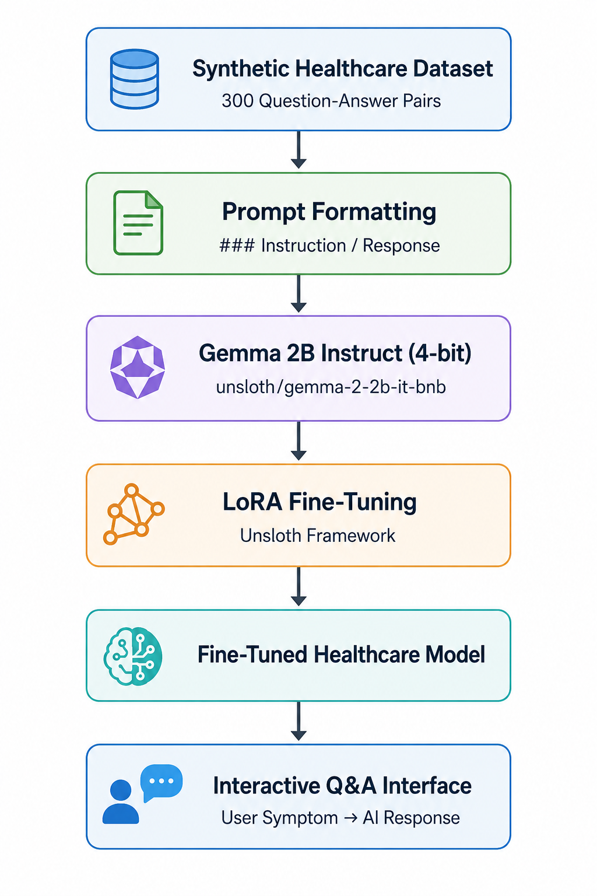

## Training Loss

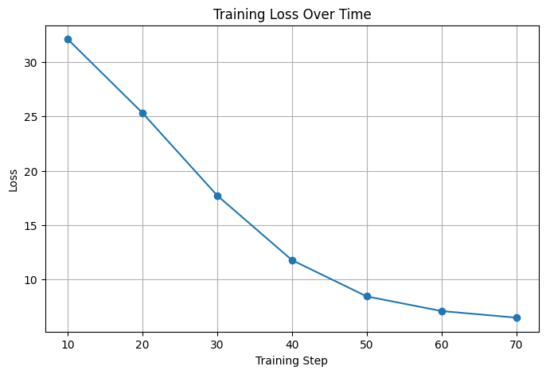

## Interactive Healthcare Assistant

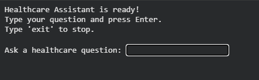

## Project Summary

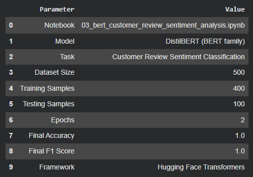

## Applications

- Symptom-based healthcare assistant
- Medical triage support
- Patient education chatbot
- Telemedicine support system

---

# Notebook 2: Multi-Source Data Access and Benchmarking

## Objective

Demonstrate how to retrieve and compare data from:

1. PostgreSQL (Neon)
2. Google Drive CSV
3. Supabase

## Key Features

- Cloud PostgreSQL integration
- Google Drive CSV loading
- Supabase table creation and retrieval
- Schema validation across sources
- Retrieval time benchmarking
- Comparative visualizations
- Data integrity verification
- Final project summary table

## Dataset Details

| Attribute | Value |
|---------|------|
| Dataset | Synthetic E-Commerce Orders |
| Total Records | 100 |
| Total Features | 11 |

## Data Pipeline Architecture

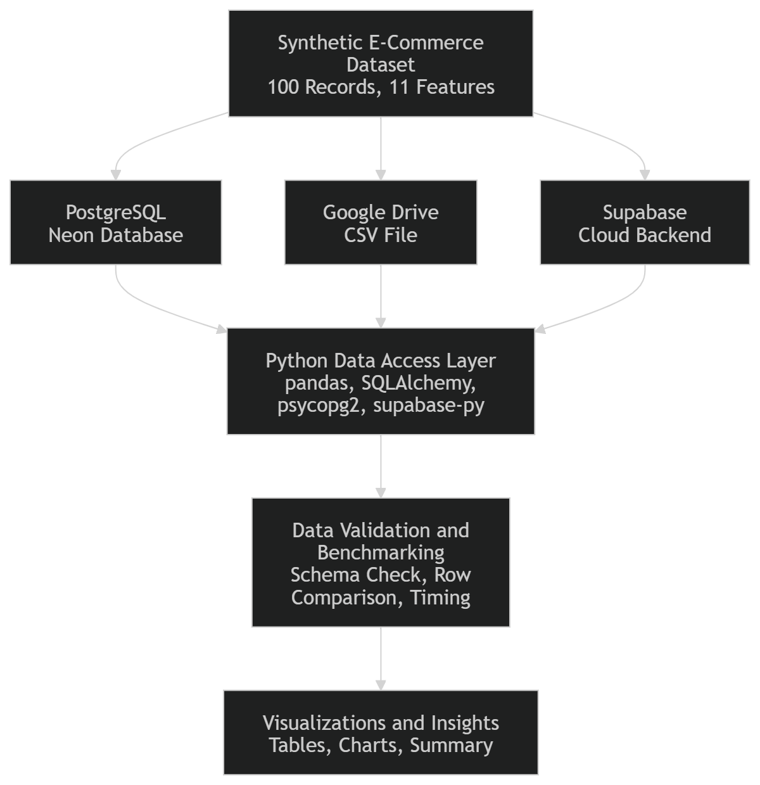

## Source Comparison Table

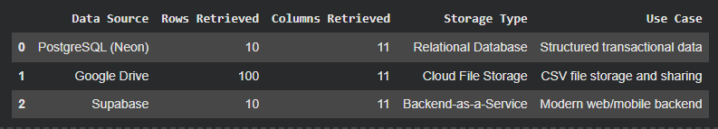

## Rows Retrieved Comparison

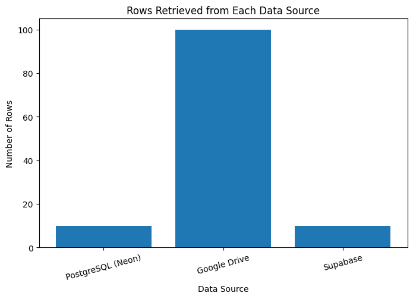

## Retrieval Time Comparison

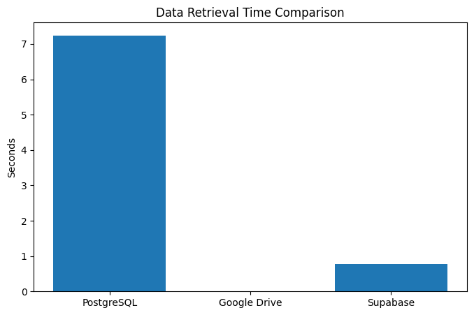

## Project Summary

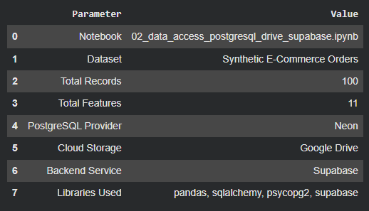

## Applications

- ETL pipelines
- Cloud data integration
- Analytics workflows
- Dashboard backends
- Data validation and benchmarking

---

# Notebook 3: BERT-Based Customer Review Sentiment Analysis

## Objective

Fine-tune DistilBERT for binary sentiment classification of customer reviews.

## Key Features

- DistilBERT fine-tuning
- Training and evaluation metrics
- Class distribution visualization
- Training loss curve
- Confusion matrix
- Classification report
- Probability bar chart
- Sample predictions table
- Interactive sentiment analysis console
- Confidence score reporting
- Final project summary table

## Model Configuration

| Parameter | Value |
|---------|------|
| Base Model | `distilbert-base-uncased` |
| Task | Sequence Classification |
| Dataset Size | 500 Reviews |
| Train/Test Split | 80/20 |
| Epochs | 2 |
| Batch Size | 16 |
| Learning Rate | 2e-5 |

## Workflow Diagram

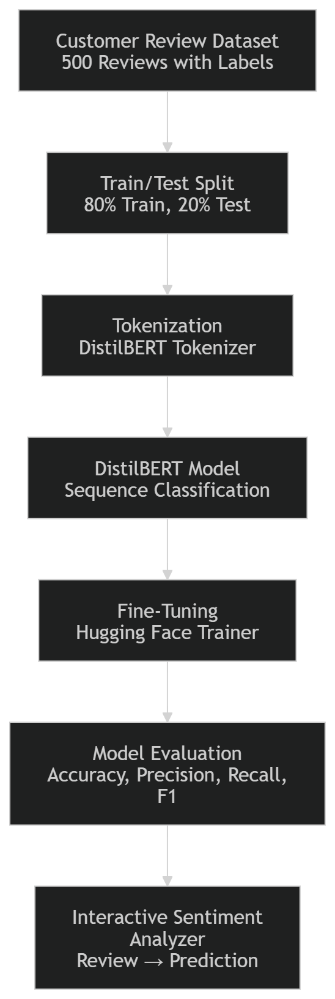

## Sentiment Class Distribution

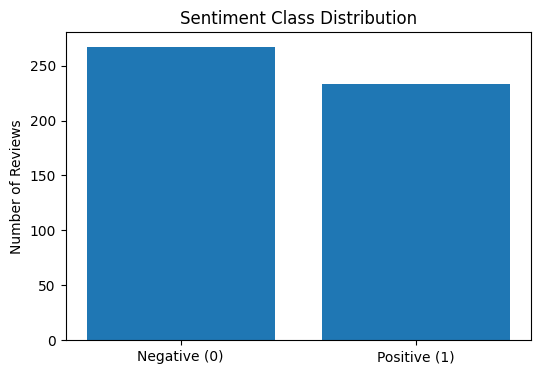

## Training Loss Curve

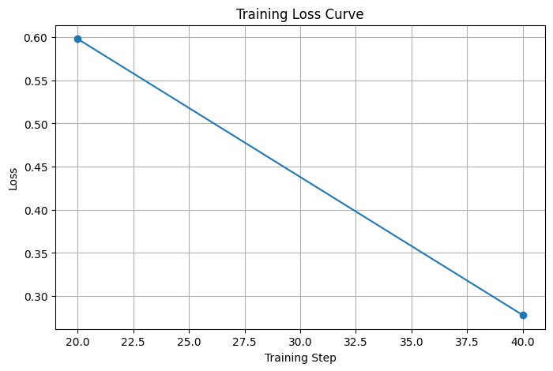

## Confusion Matrix

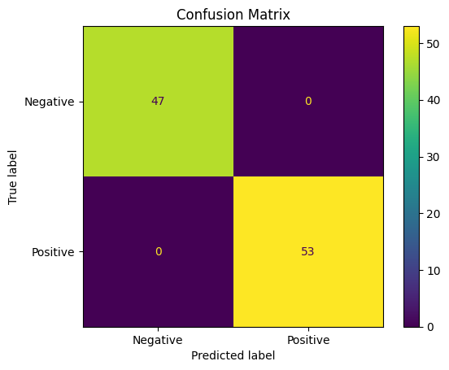

## Probability Bar Chart

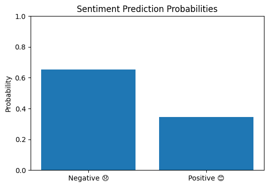

## Interactive Sentiment Analyzer

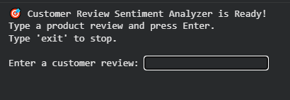

## Project Summary

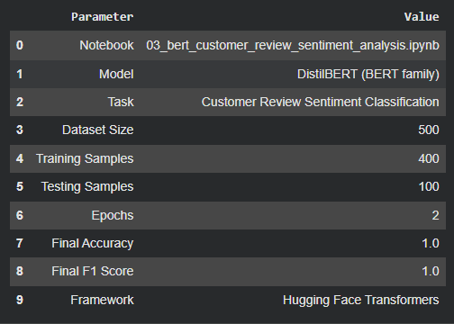

## Evaluation Results

| Metric | Score |
|------|------:|
| Accuracy | 1.0000 |
| Precision | 1.0000 |
| Recall | 1.0000 |
| F1 Score | 1.0000 |
| Evaluation Loss | 0.3272 |

## Applications

- Customer review analytics
- Product quality monitoring
- Brand reputation tracking
- Customer satisfaction analysis

---

## Comparative Summary

| Notebook | Domain | Primary Outcome |
|-------|-------|----------------|
| Notebook 1 | Large Language Models | Healthcare conversational model |
| Notebook 2 | Data Engineering | Multi-source data integration |
| Notebook 3 | Natural Language Processing | Sentiment prediction system |

---

## Skills Demonstrated

### Large Language Models
- LoRA fine-tuning
- Quantization
- Prompt engineering

### Natural Language Processing
- Tokenization
- Text classification
- Sentiment analysis

### Data Engineering
- PostgreSQL integration
- Supabase API usage
- Data benchmarking

### Machine Learning
- Transfer learning
- Model evaluation
- Interactive inference

### Software Engineering
- Modular repository design
- Documentation
- Reproducibility

---

## Setup Instructions

### Clone the Repository

```bash
git clone https://github.com/<your-username>/Healthcare_AI_Notebooks.git
cd Healthcare_AI_Notebooks
```

### Install Dependencies

```bash
pip install -r requirements.txt
```

### Launch Jupyter Notebook

```bash
jupyter notebook
```

### Open and Run the Notebooks

Execute the notebooks in the following order:

1. `01_healthcare_llm_unsloth_gemma.ipynb`
2. `02_data_access_postgres_drive_supabase.ipynb`
3. `03_bert_sentiment_analysis.ipynb`

---

## Requirements

All required dependencies are listed in `requirements.txt`.

Core packages include:

- torch
- transformers
- datasets
- unsloth
- pandas
- numpy
- matplotlib
- scikit-learn
- sqlalchemy
- psycopg2-binary
- supabase

---

## Documentation

A detailed project report is available in:

```text
documents/project_report.pdf
```

---

## Key Learnings

- Fine-tuned Gemma for healthcare question-answering using Unsloth.
- Integrated data from PostgreSQL, Google Drive, and Supabase.
- Built an end-to-end DistilBERT sentiment classifier.
- Evaluated models using industry-standard metrics.
- Developed interactive user interfaces for inference.
- Organized the project using a professional GitHub structure.

---

## Future Enhancements

### Notebook 1
- Real-world healthcare datasets
- Retrieval-Augmented Generation (RAG)
- Multilingual support

### Notebook 2
- Larger datasets
- Incremental data loading
- Additional data warehouses

### Notebook 3
- Real Amazon or Yelp review datasets
- Multi-class sentiment analysis
- Web application deployment

---

## Author

**B Adheje**  
AI and Data Science Enthusiast  
Tirunelveli, Tamil Nadu, India
